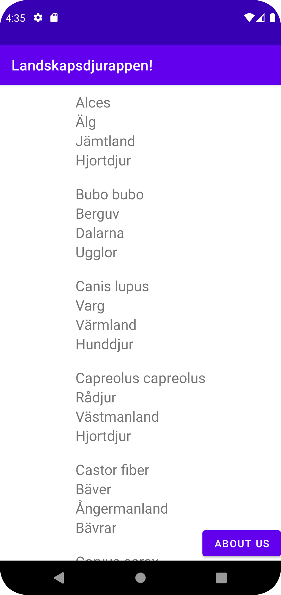
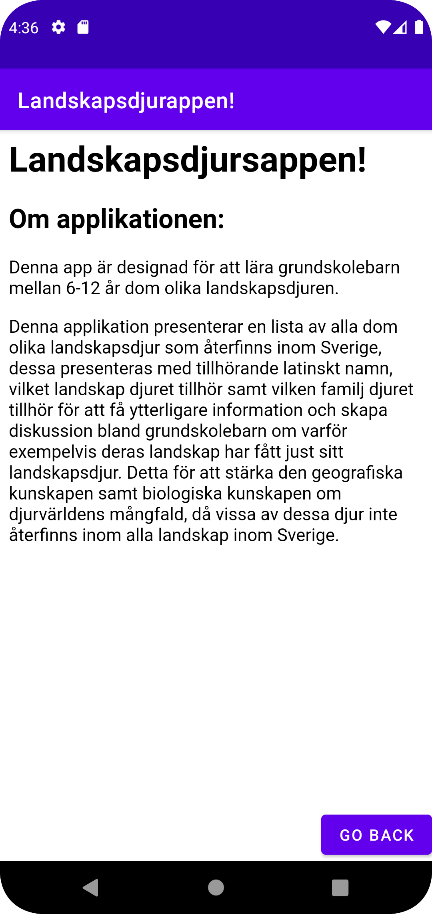

## Projekt Rapport
** Skapandet av XML-Filer samt tillhörande styling **
-- Det första jag började med var att skapa en RecyclerView samt en intent-knapp i min main_activity.xml
```
    <androidx.recyclerview.widget.RecyclerView
        android:id="@+id/recycler_view"
        android:layout_width="wrap_content"
        android:layout_height="match_parent"
        app:layout_constraintStart_toStartOf="parent"
        app:layout_constraintEnd_toEndOf="parent"
        app:layout_constraintTop_toBottomOf="parent"
        app:layout_constraintBottom_toTopOf="parent"
        />

    <Button
        android:id="@+id/mainIntent"
        android:layout_width="wrap_content"
        android:layout_height="wrap_content"
        android:text="About us"
        app:layout_constraintEnd_toEndOf="parent"
        app:layout_constraintBottom_toBottomOf="parent"
    />
```
-- Denna RecyclerView av självklara fall för att presentera den relevanta datan, sedan en knapp för att ta mig till den andra akvititeten som kommer bli min "About"-sida.
-- Sedan så skapade jag denna andra aktivitet samt tillhörande XML-Fil som blev som följande
```
    <WebView
        android:id="@+id/webViewAbout"
        android:layout_width="match_parent"
        android:layout_height="match_parent"
        android:text="About us"
        app:layout_constraintEnd_toEndOf="parent"
        app:layout_constraintStart_toStartOf="parent"
        app:layout_constraintTop_toTopOf="parent"
        />

    <Button
        android:id="@+id/aboutIntent"
        android:layout_width="wrap_content"
        android:layout_height="wrap_content"
        android:text="Go back"
        app:layout_constraintEnd_toEndOf="parent"
        app:layout_constraintBottom_toBottomOf="@id/webViewAbout"
        />
```
-- Hära valde jag att göra en WebView som presenterar min "About Us" information, mer om detta senare inom rapporten. 

-- Slutligen så gjorde jag min XML-Fil som skall representera alla objekt inom min RecyclerView, dessa har flera items med samma design förutom ID:t, exemplet nedanför är på itemet "ID".

```
 <TextView
        android:id="@+id/ID"
        android:layout_width="wrap_content"
        android:layout_height="wrap_content"
        app:layout_constraintTop_toTopOf="parent"
        app:layout_constraintStart_toStartOf="parent"
        android:textSize="20sp"
        />
```
** Skapandet av RecyclerView **
-- Det första steget var att inhämta den RecyclerView jag skapade i min activity_main.xml-fil, skapade den Arrayen som kommer innehålla alla objekt som skall presenteras i min RecyclerView,. 
samt tilldela denna lista en adapter samt en LinearLayoutManager.
```
        listOfItems = new ArrayList<Items>();
        adapter = new MyAdapter(listOfItems);
        RecyclerView = findViewById(R.id.recycler_view);
        RecyclerView.setLayoutManager(new LinearLayoutManager(this));
        RecyclerView.setAdapter(adapter);
```
-- Sedan så skapade jag min items.java, detta är den javafilen som "listOfItems = new ArrayList<Items>();" refererar till, inom denna generarade jag getters samt setters för alla dom objekt/items
som kommer att presenteras inom min RecyclerView, nedanför är ett exempel på en getter samt setter för "ID".
```
package com.example.project;

public class Items {
    private String ID;
    private String name;
    private String location;
    private String category;

    public Items(String ID, String name, String location, String category) {
        this.ID = ID;
        this.name = name;
        this.location = location;
        this.category = category;
    }

    public String getID() {
        return ID;
    }

    public void setID(String ID) {
        this.ID = ID;
    }
```
-- Sedan så skapade jag min Adapter, detta var något som jag fann väldigt förvirrande när vi gjorde vår Networking-uppgift men jag lyckades lösa den vid det skedet efter den repitering vi hade inom klassrummet,
jag bestämde mig hära för att försöka klara av den utan att dubbelkolla hur jag skapade den i vår Networking-uppgift, vilket blev en väldigt klurig uppgift men något jag faktiskt lyckades lösa med lite svett och dedikation.
Detta primärt för att man kan generera dom faktiska funktionerna utifrån tidigare kod, och jag endast behövde fylla i dessa funktioner med vad jag kom ihåg. 
```
public class MyAdapter extends RecyclerView.Adapter<MyViewHolder> {
    private List<Items> listOfItems;
    public MyAdapter(List<Items> listOfItems) {
        this.listOfItems = listOfItems;
    }

    @NonNull
    @Override
    public MyViewHolder onCreateViewHolder(@NonNull ViewGroup parent, int viewType) {
        View view = LayoutInflater.from(parent.getContext()).inflate(R.layout.recyclerview_items, parent, false);
        return new MyViewHolder(view);
    }

    @Override
    public void onBindViewHolder(@NonNull MyViewHolder holder, int position) {
        holder.ID.setText(listOfItems.get(position).getID());
        holder.Category.setText(listOfItems.get(position).getCategory());
        holder.Location.setText(listOfItems.get(position).getLocation());
        holder.Name.setText(listOfItems.get(position).getName());
    }

    @Override
    public int getItemCount() {
        return listOfItems.size();
    }
}
```
-- Slutligen så skapade jag min ViewHolder, vilket är en mycket enklare och snabbare process än att skapa en tillhörande Adapter.
```
public class MyViewHolder extends RecyclerView.ViewHolder {
    public TextView ID;
    public TextView Category;
    public TextView Location;
    public TextView Name;

    public MyViewHolder(@NonNull View itemView) {
        super(itemView);
        ID = itemView.findViewById(R.id.ID);
        Category = itemView.findViewById(R.id.Category);
        Name = itemView.findViewById(R.id.Name);
        Location = itemView.findViewById(R.id.Location);
    }
}
```
-- Efter att alla dessa tillhörande bitar var på sin plats var det dags att faktiskt koppla ihop dessa, det med hjälp av den "JsonTask"-klassen som vi blev givna av lärarna som krävs för den JSON-datan som skall presenteras,
Denna aktiveras genom följande kod:
```
        new JsonTask(this).execute(JSON_URL);
```
-- I detta fall är JSON_URL endast en variabel vars innehåll är den webbplats vi tar datan ifrån.

-- Sedan så använde jag mig av ytterligare en bit kod som är relevant för att just hantera JSON-data och kunna tolka denna samt presentera denna, nämligen denna bit kod som vi fick av lärarna,
denna fungerar endast efter att korrekt "Dependencies" är infogade samt applikationen har tillgång till internet.

```
    public void onPostExecute(String json){
        Gson gson = new Gson();
        Type type = new TypeToken<ArrayList<Items>>(){}.getType();
        ArrayList<Items> lista = gson.fromJson(json, type);
        listOfItems.addAll(lista);
        adapter.notifyDataSetChanged();
    }
```

** Skapandet av intent-knappar **
-- Sedan så skapade jag dom knappar som kommer ta användaren mellan den primära aktiviteten med RecyclerView samt den andra med "About us" information, dessa knappars xml-styling presenterades ovanför men detta är hur dessa infogades i Java
```
        intentButton = findViewById(R.id.mainIntent);
        intentButton.setOnClickListener(new View.OnClickListener() {
            @Override
            public void onClick(View view) {
                Log.d(TAG, "Intent button in MainActivity pressed");
                Intent intent = new Intent(MainActivity.this, AboutActivity.class);
                startActivity(intent);
            }
        });
```
-- Och i min andra aktivitet där jag visar "About us" informationen gäller liknande princip fast jag använder "finish()" istället för en egen intent.
```
        aboutButton.setOnClickListener(new View.OnClickListener() {
            @Override
            public void onClick(View view) {
                Log.d(TAG, "Intent button in AboutActivity pressed");
                finish();
            }
        });
```

** Skapandet av WebView **
-- Ovanför så presenterades min WebView när XML-filerna presenterades, men i den faktiska koden så började jag först med att hämta in den till en variabel, sedan skapa en ny "WebViewClient" samt ge denna tillhörighet till att använda sig av JavaScript,
jag var även tvungen att göra en funktion som laddar in den givna hemsidan till WebViewen, en funktion som körs inom "onCreate".

```
        myWebView = findViewById(R.id.webViewAbout);
        myWebView.getSettings().setJavaScriptEnabled(true);
        myWebView.setWebViewClient(new WebViewClient());
```

```
    public void showInternalWebPage() {
        myWebView.loadUrl("file:///android_asset/index.html");
    }
```
## Skärmdumpar ##


